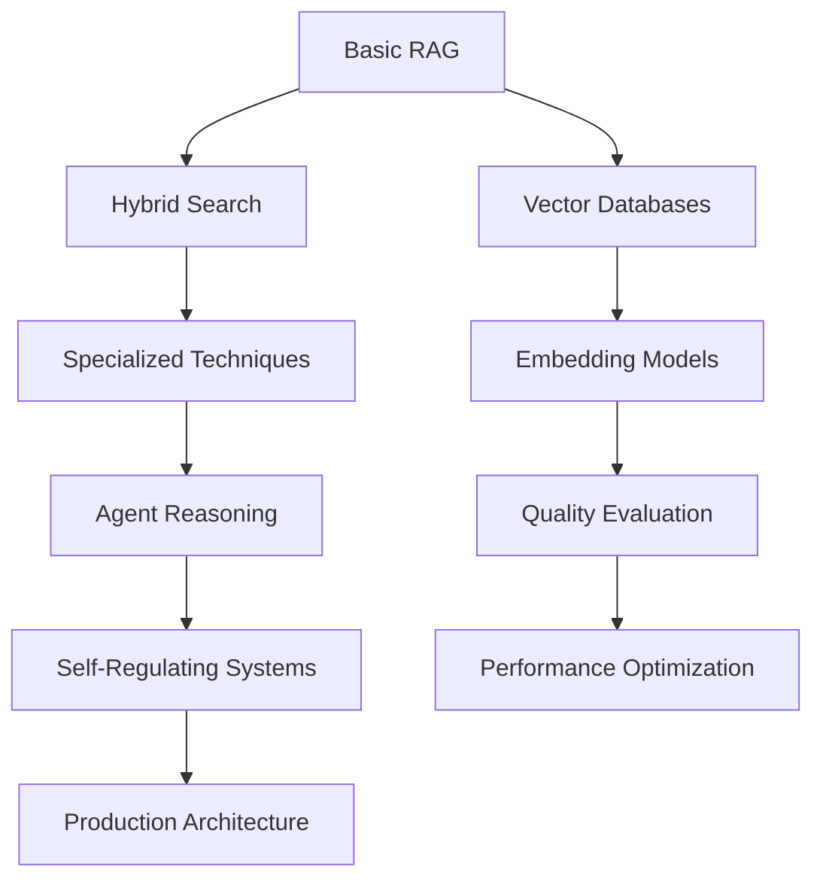

# 🎓 **RAG & Agentic AI Learning Curriculum**

*A Comprehensive Guide to Mastering Retrieval-Augmented Generation and Agent-Based AI Systems*

---

## 📚 **Table of Contents**

1. [Learning Path Overview](#-learning-path-overview)
2. [Prerequisites & Setup](#-prerequisites--setup)
3. [Module 1: RAG Fundamentals](#-module-1-rag-fundamentals)
4. [Module 2: Advanced RAG Techniques](#-module-2-advanced-rag-techniques)
5. [Module 3: Agent Frameworks](#-module-3-agent-frameworks)
6. [Module 4: Agentic RAG Systems](#-module-4-agentic-rag-systems)
7. [Assessment & Projects](#-assessment--projects)
8. [Industry Applications](#-industry-applications)
9. [Resources & Further Reading](#-resources--further-reading)

---

## 🗺️ **Learning Path Overview**

### **Curriculum Goals**
By completing this curriculum, you will:
- ✅ Understand the fundamentals of Retrieval-Augmented Generation (RAG)
- ✅ Master advanced RAG techniques for specialized use cases
- ✅ Build autonomous agent systems with reasoning capabilities
- ✅ Design production-ready agentic RAG architectures
- ✅ Apply AI systems to real-world business problems

### **Learning Journey Timeline**
```
📍 Beginner (Weeks 1-2)     → RAG Fundamentals
📍 Intermediate (Weeks 3-6) → Advanced RAG Techniques  
📍 Advanced (Weeks 7-9)     → Agent Frameworks
📍 Expert (Weeks 10-12)     → Agentic RAG Systems
📍 Mastery (Weeks 13-16)    → Capstone Projects
```

### **Skill Progression Map**


---

## 🔧 **Prerequisites & Setup**

### **Technical Requirements**
- **Python 3.8+** with virtual environment management
- **Basic Machine Learning** understanding (embeddings, transformers)
- **API Integration** experience (REST APIs, authentication)
- **Cloud Services** familiarity (optional but recommended)

### **Development Environment**
```bash
# Create learning environment
python -m venv rag_learning_env
source rag_learning_env/bin/activate  # Linux/Mac
# or
rag_learning_env\Scripts\activate  # Windows

# Install core dependencies
pip install langchain langchain-community
pip install openai anthropic  # LLM providers
pip install faiss-cpu chromadb  # Vector databases
pip install jupyter notebook  # Interactive development
```

### **API Keys Setup**
Create a `.env` file with your API credentials:
```bash
OPENAI_API_KEY=your_openai_key
ANTHROPIC_API_KEY=your_anthropic_key
TAVILY_API_KEY=your_tavily_key  # For web search
ATHINA_API_KEY=your_athina_key  # For evaluation
```

### **Learning Resources**
- 📖 **Notebooks**: Hands-on implementations in `/notebooks/`
- 📊 **Data**: Tesla Q3 financial reports and sample datasets
- 🔗 **Documentation**: Links to relevant papers and documentation
- 💡 **Examples**: Real-world use case implementations

---

## 🎯 **Module 1: RAG Fundamentals**

### **Learning Objectives**
- Understand the motivation and architecture of RAG systems
- Implement basic document retrieval and generation
- Master vector embeddings and similarity search
- Build your first functional RAG application

### **📚 Core Concepts**

#### **1.1 Introduction to RAG**
**Notebook**: `advanced_rag_techniques/naive_rag.ipynb`

**Key Topics:**
- What is Retrieval-Augmented Generation?
- Problems RAG solves (hallucination, knowledge cutoff, domain expertise)
- RAG vs. Fine-tuning vs. Prompt Engineering
- Basic RAG architecture components

**Hands-on Exercise:**
```python
# Your first RAG system
from langchain import OpenAI, VectorStore
from langchain.document_loaders import CSVLoader

# Load documents
loader = CSVLoader("data/context.csv")
documents = loader.load()

# Create embeddings
embeddings = OpenAIEmbeddings()
vectorstore = FAISS.from_documents(documents, embeddings)

# Simple retrieval and generation
def simple_rag(question):
    docs = vectorstore.similarity_search(question, k=3)
    context = "\n".join([doc.page_content for doc in docs])
    return llm.generate(f"Context: {context}\nQuestion: {question}")
```

**💡 Learning Outcomes:**
- Build a functional RAG system from scratch
- Understand document chunking and embedding strategies
- Implement basic similarity search and context assembly
- Recognize when RAG is the right solution for a problem

### **🔬 Practical Labs**

#### **Lab 1.1: Document Processing Pipeline**
- Load different document types (CSV, PDF, TXT)
- Experiment with chunking strategies (fixed size, semantic)
- Compare embedding models (OpenAI, HuggingFace, Sentence Transformers)
- Measure retrieval quality with simple metrics

#### **Lab 1.2: Vector Database Comparison**
- Implement the same RAG system with FAISS, ChromaDB, and Pinecone
- Compare performance, scalability, and ease of use
- Understand trade-offs between local and cloud vector databases

### **📋 Assessment Checklist**
- [ ] Can explain RAG architecture and components
- [ ] Built working RAG system with custom documents
- [ ] Understands vector embeddings and similarity search
- [ ] Can identify appropriate use cases for basic RAG

---

## 🚀 **Module 2: Advanced RAG Techniques**

### **Learning Objectives**
- Master specialized RAG techniques for complex scenarios
- Implement multi-modal and hybrid retrieval strategies
- Optimize retrieval quality and response accuracy
- Handle challenging document types and query patterns

### **📚 Advanced Techniques Deep Dive**

#### **2.1 Hybrid RAG - Best of Both Worlds**
**Notebook**: `advanced_rag_techniques/hybrid_rag.ipynb`

**Concept**: Combine vector similarity with keyword search for comprehensive retrieval.

**When to Use:**
- Queries requiring exact term matches (names, codes, specific phrases)
- Domains where semantic and lexical relevance both matter
- Large document collections with diverse content types

**Implementation Focus:**
```python
# Hybrid retrieval strategy
from langchain.retrievers import EnsembleRetriever

vector_retriever = vectorstore.as_retriever(search_kwargs={"k": 3})
keyword_retriever = BM25Retriever.from_documents(documents)

ensemble_retriever = EnsembleRetriever(
    retrievers=[vector_retriever, keyword_retriever],
    weights=[0.7, 0.3]  # Favor semantic search
)
```

#### **2.2 Contextual RAG - Smart Context Management**
**Notebook**: `advanced_rag_techniques/contextual_rag.ipynb`

**Concept**: Add contextual information to chunks for better retrieval accuracy.

**Advanced Features:**
- Document metadata integration
- Hierarchical context preservation
- Context-aware chunk boundaries
- Dynamic context expansion

#### **2.3 Fusion RAG - Multi-Query Synthesis**
**Notebook**: `advanced_rag_techniques/fusion_rag.ipynb`

**Concept**: Generate multiple query variations and fuse results for comprehensive answers.

**Technical Implementation:**
```python
def generate_query_variations(original_query):
    variations = [
        f"What information is available about {original_query}?",
        f"Can you explain {original_query} in detail?",
        f"What are the key facts regarding {original_query}?"
    ]
    return variations

def fusion_retrieval(query_variations):
    all_results = []
    for query in query_variations:
        results = vectorstore.similarity_search(query, k=3)
        all_results.extend(results)
    
    # Remove duplicates and re-rank
    return deduplicate_and_rank(all_results)
```

#### **2.4 HyDE RAG - Hypothetical Document Enhancement**
**Notebook**: `advanced_rag_techniques/hyde_rag.ipynb`

**Concept**: Generate hypothetical answers to improve retrieval through answer-to-answer similarity.

**Advanced Application:**
- Complex reasoning tasks
- Abstract concept queries
- Domain-specific technical questions

#### **2.5 Parent Document Retriever - Hierarchical Intelligence**
**Notebook**: `advanced_rag_techniques/parent_document_retriever.ipynb`

**Concept**: Retrieve small chunks but return larger parent documents for comprehensive context.

**Use Cases:**
- Legal documents with complex structure
- Technical manuals with nested information
- Research papers with hierarchical content

### **🔬 Practical Labs**

#### **Lab 2.1: Technique Selection Matrix**
Create a decision framework for choosing the right RAG technique:

| Query Type | Document Structure | Recommended Technique | Reasoning |
|------------|-------------------|----------------------|-----------|
| Factual lookups | Structured data | Hybrid RAG | Combines precision and recall |
| Conceptual questions | Academic papers | HyDE RAG | Leverages conceptual similarity |
| Multi-part queries | Large documents | Parent Document | Maintains context |
| Ambiguous queries | Diverse content | Fusion RAG | Multiple perspectives |

#### **Lab 2.2: Performance Benchmarking**
Compare techniques on your domain-specific data:
```python
def benchmark_rag_techniques(test_queries, ground_truth):
    techniques = {
        'basic': BasicRAG(),
        'hybrid': HybridRAG(),
        'fusion': FusionRAG(),
        'hyde': HydeRAG()
    }
    
    results = {}
    for name, technique in techniques.items():
        accuracy = evaluate_technique(technique, test_queries, ground_truth)
        latency = measure_response_time(technique, test_queries)
        results[name] = {'accuracy': accuracy, 'latency': latency}
    
    return results
```

### **📋 Assessment Checklist**
- [ ] Can select appropriate RAG technique for specific use cases
- [ ] Implemented at least 3 different advanced RAG techniques
- [ ] Understands trade-offs between accuracy, speed, and complexity
- [ ] Can optimize retrieval performance for domain-specific tasks

---

## 🤖 **Module 3: Agent Frameworks**

### **Learning Objectives**
- Understand autonomous agent architectures and reasoning patterns
- Implement multi-step reasoning and planning systems
- Build self-improving agents with reflection capabilities
- Design efficient execution strategies for complex tasks

### **📚 Agent Architecture Fundamentals**

#### **3.1 ReAct - Reasoning and Acting**
**Notebook**: `agent_techniques/react.ipynb`

**Core Concept**: Combine reasoning (thought) with action (tool use) in iterative cycles.

**Architecture Pattern:**
```
Thought → Action → Observation → Thought → Action → Observation → ...
```

**Implementation Deep Dive:**
```python
class ReActAgent:
    def __init__(self, llm, tools):
        self.llm = llm
        self.tools = tools
        self.memory = []
    
    def execute(self, task):
        while not self.is_complete(task):
            # Reasoning step
            thought = self.llm.generate(self.build_reasoning_prompt())
            
            # Action step
            action = self.parse_action(thought)
            observation = self.execute_action(action)
            
            # Update memory
            self.memory.append({
                'thought': thought,
                'action': action,
                'observation': observation
            })
        
        return self.synthesize_final_answer()
```

**Advanced Features:**
- Tool selection strategies
- Error handling and recovery
- Multi-step planning
- Dynamic replanning

#### **3.2 Reflexion - Self-Improvement Through Reflection**
**Notebook**: `agent_techniques/reflexion.ipynb`

**Core Concept**: Agents that learn from mistakes and improve performance over time.

**Reflection Cycle:**
```
Execute → Evaluate → Reflect → Learn → Execute (Improved)
```

**Technical Implementation:**
```python
class ReflexionAgent:
    def __init__(self):
        self.experience_buffer = []
        self.performance_metrics = {}
    
    def execute_with_reflection(self, task):
        # Initial execution
        result = self.execute_task(task)
        
        # Self-evaluation
        evaluation = self.evaluate_performance(task, result)
        
        # Generate reflection
        reflection = self.generate_reflection(evaluation)
        
        # Update strategy
        self.update_strategy(reflection)
        
        # Re-execute if necessary
        if evaluation['needs_improvement']:
            result = self.execute_task(task)
        
        return result
```

#### **3.3 ReWOO - Reasoning Without Observation**
**Notebook**: `agent_techniques/rewoo.ipynb`

**Core Concept**: Plan entire task execution upfront, then execute all actions, reducing LLM calls.

**Efficiency Benefits:**
- Reduced inference costs (fewer LLM calls)
- Parallelizable action execution
- More predictable performance
- Better resource utilization

### **🔬 Practical Labs**

#### **Lab 3.1: Agent Performance Comparison**
Compare agent frameworks on complex multi-step tasks:

```python
def compare_agent_frameworks(complex_tasks):
    agents = {
        'react': ReActAgent(),
        'reflexion': ReflexionAgent(),
        'rewoo': ReWOOAgent()
    }
    
    metrics = {}
    for name, agent in agents.items():
        results = []
        for task in complex_tasks:
            start_time = time.time()
            result = agent.execute(task)
            execution_time = time.time() - start_time
            
            results.append({
                'accuracy': evaluate_accuracy(result, task.ground_truth),
                'efficiency': execution_time,
                'llm_calls': agent.count_llm_calls(),
                'success_rate': result.success
            })
        
        metrics[name] = aggregate_metrics(results)
    
    return metrics
```

#### **Lab 3.2: Custom Agent Development**
Build a domain-specific agent for your use case:

1. **Define Agent Goals**: What should your agent accomplish?
2. **Select Tools**: What external tools/APIs does it need?
3. **Design Reasoning Pattern**: How should it approach problems?
4. **Implement Evaluation**: How do you measure success?
5. **Add Learning**: How can it improve over time?

### **📋 Assessment Checklist**
- [ ] Can explain different agent reasoning patterns and their trade-offs
- [ ] Implemented functional agents using ReAct, Reflexion, and ReWOO
- [ ] Understands when to use each agent framework
- [ ] Can design custom agents for specific domain problems

---

## 🧠 **Module 4: Agentic RAG Systems**

### **Learning Objectives**
- Combine agent reasoning with retrieval-augmented generation
- Build self-regulating and self-correcting RAG systems
- Implement production-ready architectures with quality control
- Design adaptive systems that improve over time

### **📚 Advanced Agentic RAG Architectures**

#### **4.1 Adaptive RAG - Intelligent Routing**
**Notebook**: `agentic_rag_techniques/adaptive_rag.ipynb`

**Core Concept**: Dynamically choose retrieval strategies based on query characteristics.

**Architecture Components:**
```python
class AdaptiveRAGRouter:
    def __init__(self):
        self.strategies = {
            'simple': SimpleRAG(),
            'hybrid': HybridRAG(),
            'fusion': FusionRAG(),
            'hyde': HydeRAG()
        }
        self.classifier = QueryClassifier()
    
    def route_query(self, query):
        query_features = self.extract_features(query)
        strategy = self.classifier.predict_best_strategy(query_features)
        return self.strategies[strategy].process(query)
```

**Advanced Features:**
- Query complexity analysis
- Performance-based routing
- Dynamic strategy weights
- Continuous learning from feedback

#### **4.2 Basic Agentic RAG - Foundation**
**Notebook**: `agentic_rag_techniques/basic_agentic_rag.ipynb`

**Core Concept**: Agent-controlled tool selection between VectorStore and WebSearch.

**Decision Framework:**
```python
def intelligent_tool_selection(query):
    analysis = analyze_query_requirements(query)
    
    if analysis['needs_current_info']:
        return 'web_search'
    elif analysis['domain_specific']:
        return 'vector_store'
    elif analysis['complex_reasoning']:
        return 'hybrid_approach'
    else:
        return 'vector_store'  # Default to internal knowledge
```

#### **4.3 Corrective RAG - Quality Assurance**
**Notebook**: `agentic_rag_techniques/corrective_rag.ipynb`

**Core Concept**: Evaluate retrieved documents and take corrective actions to improve quality.

**Quality Control Pipeline:**
```python
class CorrectiveRAGPipeline:
    def process_query(self, query):
        # Initial retrieval
        documents = self.retrieve_documents(query)
        
        # Evaluate relevance
        relevance_scores = self.evaluate_relevance(query, documents)
        
        # Classify and correct
        for doc, score in zip(documents, relevance_scores):
            if score > 0.8:  # High relevance
                refined_docs.append(self.refine_document(doc))
            elif score < 0.3:  # Low relevance
                # Trigger web search for additional info
                external_info = self.web_search(query)
                additional_docs.extend(external_info)
            else:  # Medium relevance
                # Combine internal and external sources
                hybrid_context = self.create_hybrid_context(doc, query)
        
        return self.generate_response(refined_docs + additional_docs)
```

#### **4.4 Self RAG - Self-Regulating Systems**
**Notebook**: `agentic_rag_techniques/self_rag.ipynb`

**Core Concept**: LLM reflects on its own output using special reflection tokens.

**Reflection Token System:**
```python
REFLECTION_TOKENS = {
    'RETRIEVE': ['yes', 'no'],          # Should I retrieve information?
    'ISREL': ['relevant', 'irrelevant'], # Is this passage relevant?
    'ISSUP': ['fully_supported', 'partially_supported', 'no_support'],
    'ISUSE': ['useful', 'not_useful']   # Is this response useful?
}

def self_rag_generate(query, max_iterations=3):
    for iteration in range(max_iterations):
        # Generate response with reflection tokens
        response = llm.generate_with_tokens(query)
        tokens = extract_reflection_tokens(response)
        
        # Check if response meets quality standards
        if (tokens['ISSUP'] == 'fully_supported' and 
            tokens['ISUSE'] == 'useful'):
            return response
        
        # Self-correction based on reflection
        if tokens['ISSUP'] == 'no_support':
            # Need more information
            additional_context = retrieve_more_documents(query)
            query = enhance_query_with_context(query, additional_context)
    
    return response  # Return best attempt
```

#### **4.5 Production Architecture - DeepSeek + Qdrant**
**Notebook**: `agentic_rag_techniques/agentic_rag_using_deepseek_qdrant_and_langchain.ipynb`

**Core Concept**: Enterprise-grade agentic RAG with cost optimization and cloud scalability.

**Production Architecture:**
```python
class ProductionAgenticRAG:
    def __init__(self):
        # Cost-optimized reasoning model
        self.reasoning_llm = ChatDeepSeek(
            model="deepseek-reasoner",
            temperature=0.1
        )
        
        # Cloud vector database
        self.vector_store = QdrantVectorStore(
            url=os.getenv('QDRANT_URL'),
            api_key=os.getenv('QDRANT_API_KEY'),
            collection_name="production_knowledge"
        )
        
        # Professional web search
        self.web_search = TavilySearchResults(
            api_key=os.getenv('TAVILY_API_KEY'),
            max_results=5
        )
        
        # Monitoring and evaluation
        self.monitor = ProductionMonitor()
    
    def process_query(self, query):
        # Advanced reasoning for tool selection
        tool_decision = self.reasoning_llm.analyze_query(query)
        
        # Execute with monitoring
        with self.monitor.track_request():
            if tool_decision.use_vector_store:
                vector_results = self.vector_store.search(query)
            
            if tool_decision.use_web_search:
                web_results = self.web_search.search(query)
            
            # Intelligent result synthesis
            final_response = self.synthesize_results(
                vector_results, web_results, query
            )
        
        return final_response
```

### **🔬 Practical Labs**

#### **Lab 4.1: Quality Evaluation Framework**
Build comprehensive evaluation for agentic RAG systems:

```python
class AgenticRAGEvaluator:
    def __init__(self):
        self.metrics = {
            'relevance': RelevanceEvaluator(),
            'accuracy': FactualAccuracyEvaluator(),
            'completeness': CompletenessEvaluator(),
            'efficiency': EfficiencyEvaluator(),
            'cost': CostTracker()
        }
    
    def evaluate_system(self, system, test_queries):
        results = {}
        
        for query in test_queries:
            response = system.process_query(query)
            
            for metric_name, evaluator in self.metrics.items():
                score = evaluator.evaluate(query, response)
                results.setdefault(metric_name, []).append(score)
        
        # Aggregate and analyze results
        return self.aggregate_results(results)
```

#### **Lab 4.2: Production Deployment Simulation**
Simulate production environment with:
- Load testing with concurrent queries
- Error handling and graceful degradation
- Monitoring and alerting setup
- Cost optimization analysis
- Performance benchmarking

### **📋 Assessment Checklist**
- [ ] Can design and implement complex agentic RAG systems
- [ ] Understands quality control and self-regulation mechanisms
- [ ] Can optimize systems for production deployment
- [ ] Has experience with cloud-based vector databases and APIs

---

## 🏆 **Assessment & Projects**

### **Milestone Projects**

#### **Project 1: Domain-Specific RAG System (Weeks 4-5)**
**Objective**: Build a specialized RAG system for your domain of interest.

**Requirements**:
- Choose a specific domain (legal, medical, financial, technical)
- Gather and process domain-specific documents
- Implement at least 2 advanced RAG techniques
- Compare performance with baseline methods
- Create evaluation metrics relevant to your domain

**Deliverables**:
- Working RAG system with custom dataset
- Performance comparison report
- Demo video showing system capabilities
- Code documentation and setup instructions

#### **Project 2: Multi-Agent System (Weeks 8-9)**
**Objective**: Design a multi-agent system for complex task automation.

**Requirements**:
- Define a complex task requiring multiple steps
- Implement at least 2 different agent types
- Create coordination mechanism between agents
- Add error handling and recovery
- Measure system performance and reliability

**Deliverables**:
- Multi-agent system implementation
- Task decomposition and coordination strategy
- Performance analysis and bottleneck identification
- Recommendations for scaling and improvement

#### **Project 3: Production Agentic RAG (Weeks 11-12)**
**Objective**: Build a production-ready agentic RAG system.

**Requirements**:
- Cloud-based vector database integration
- Cost-optimized model selection
- Quality assurance and monitoring
- API development with proper authentication
- Load testing and performance optimization

**Deliverables**:
- Production-ready system deployment
- API documentation and usage examples
- Performance benchmarks and cost analysis
- Monitoring dashboard and alerting setup
- User feedback collection and analysis

### **Capstone Project (Weeks 13-16)**
**Objective**: Develop an innovative application combining all learned techniques.

**Possible Directions**:
- **Enterprise Knowledge Assistant**: Company-wide intelligent search and Q&A
- **Research Acceleration Platform**: AI-powered literature review and synthesis
- **Customer Support Automation**: Multi-modal support with human handoff
- **Financial Analysis Agent**: Real-time market analysis with document research
- **Educational Tutoring System**: Personalized learning with adaptive content

**Evaluation Criteria**:
- **Technical Innovation** (25%): Novel application of techniques
- **System Design** (25%): Architecture quality and scalability
- **User Experience** (20%): Interface design and usability
- **Performance** (15%): Speed, accuracy, and reliability
- **Documentation** (15%): Code quality and documentation

---

## 🏭 **Industry Applications**

### **Financial Services**
**Use Cases**:
- Regulatory compliance research and monitoring
- Investment analysis with real-time market data
- Risk assessment combining internal and external data
- Customer service with account-specific information

**Technical Implementation**:
```python
class FinancialRAGSystem:
    def __init__(self):
        self.compliance_db = RegulationVectorStore()
        self.market_data = RealTimeMarketAPI()
        self.client_db = SecureClientDatabase()
    
    def analyze_investment(self, query, client_id):
        # Combine multiple data sources
        regulatory_context = self.compliance_db.search(query)
        market_context = self.market_data.get_current_data(query)
        client_profile = self.client_db.get_profile(client_id)
        
        return self.generate_analysis(query, regulatory_context, 
                                     market_context, client_profile)
```

### **Healthcare & Life Sciences**
**Use Cases**:
- Medical literature research and synthesis
- Drug discovery knowledge integration
- Clinical decision support systems
- Patient education and communication

**Specialized Considerations**:
- HIPAA compliance and data privacy
- Medical terminology and concept understanding
- Integration with electronic health records
- Real-time clinical guideline updates

### **Technology Companies**
**Use Cases**:
- Technical documentation search and maintenance
- Code review and best practice recommendations
- Competitive intelligence and market analysis
- Customer support and troubleshooting automation

**Technical Stack**:
```python
class TechCompanyRAG:
    def __init__(self):
        self.code_db = CodebaseVectorStore()
        self.docs_db = DocumentationStore()
        self.external_intel = CompetitiveIntelligenceAPI()
    
    def technical_support(self, user_query, context):
        # Multi-source technical assistance
        code_examples = self.code_db.find_similar_patterns(user_query)
        documentation = self.docs_db.search_relevant_docs(user_query)
        community_solutions = self.external_intel.search_solutions(user_query)
        
        return self.synthesize_technical_response(
            user_query, code_examples, documentation, community_solutions
        )
```

### **Legal Industry**
**Use Cases**:
- Case law research and precedent analysis
- Contract review and risk assessment
- Regulatory compliance monitoring
- Legal document drafting assistance

**Specialized Features**:
- Citation accuracy and verification
- Jurisdiction-specific legal research
- Confidence scoring for legal advice
- Integration with legal databases (Westlaw, LexisNexis)

---

## 📖 **Resources & Further Reading**

### **Essential Papers**
1. **RAG Foundations**:
   - "Retrieval-Augmented Generation for Knowledge-Intensive NLP Tasks" (Lewis et al., 2020)
   - "Improving language models by retrieving from trillions of tokens" (Borgeaud et al., 2022)

2. **Advanced RAG Techniques**:
   - "Self-RAG: Learning to Retrieve, Generate, and Critique through Self-Reflection" (Asai et al., 2023)
   - "Corrective Retrieval Augmented Generation" (Yan et al., 2024)

3. **Agent Frameworks**:
   - "ReAct: Synergizing Reasoning and Acting in Language Models" (Yao et al., 2022)
   - "Reflexion: Language Agents with Verbal Reinforcement Learning" (Shinn et al., 2023)

### **Technical Documentation**
- **LangChain**: Comprehensive framework documentation
- **Vector Databases**: Pinecone, Qdrant, ChromaDB, FAISS guides
- **LLM APIs**: OpenAI, Anthropic, DeepSeek integration guides
- **Evaluation Tools**: Athina, LangSmith, Weights & Biases

### **Community Resources**
- **GitHub Repositories**: Curated list of RAG implementations
- **Discord Communities**: LangChain, AI Engineering communities
- **YouTube Channels**: Technical deep-dives and tutorials
- **Blogs**: Research updates and implementation guides

### **Certification Programs**
- **LangChain Certification**: Official certification program
- **Cloud Provider Certifications**: AWS AI/ML, Google Cloud AI, Azure AI
- **Vector Database Certifications**: Pinecone, Qdrant specialist programs

---

## 🎯 **Learning Success Metrics**

### **Knowledge Assessment**
- **Conceptual Understanding**: Can explain RAG and agent concepts clearly
- **Technical Implementation**: Can build systems from scratch
- **System Design**: Can architect scalable, production-ready systems
- **Problem Solving**: Can select appropriate techniques for specific challenges

### **Practical Skills**
- **Code Quality**: Clean, documented, maintainable implementations
- **Performance Optimization**: Can identify and resolve bottlenecks
- **Evaluation**: Can measure and improve system performance
- **Deployment**: Can deploy systems to production environments

### **Professional Development**
- **Portfolio Projects**: Demonstrable real-world applications
- **Technical Communication**: Can explain complex systems to stakeholders
- **Continuous Learning**: Stays updated with rapid field evolution
- **Industry Application**: Can apply learning to business problems

---

## 🚀 **Next Steps After Completion**

### **Advanced Specializations**
1. **Multi-Modal RAG**: Images, audio, video integration
2. **Federated Learning**: Privacy-preserving distributed systems
3. **Edge Deployment**: Mobile and IoT RAG systems
4. **Custom Model Training**: Fine-tuning for domain-specific applications

### **Research Opportunities**
- Contribute to open-source RAG frameworks
- Explore novel retrieval and generation techniques
- Publish case studies and performance analyses
- Participate in AI research communities

### **Career Paths**
- **AI Engineer**: Building production AI systems
- **Research Scientist**: Advancing the state of the art
- **Solutions Architect**: Designing enterprise AI strategies
- **Technical Consultant**: Helping organizations adopt AI technologies

---

*This curriculum is designed to be adaptive and evolving. As you progress through the modules, feel free to dive deeper into areas that interest you most or that are most relevant to your specific goals and applications.*

**Happy Learning! 🎉**
